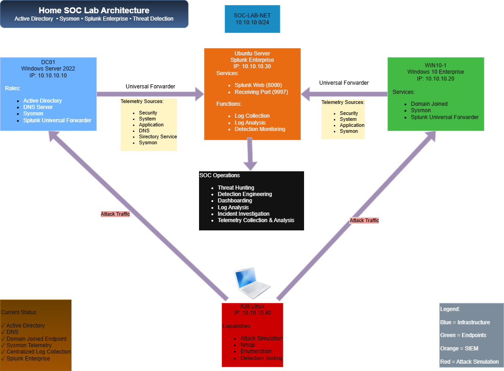
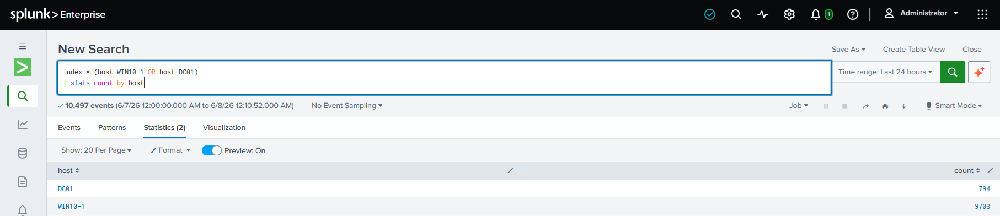
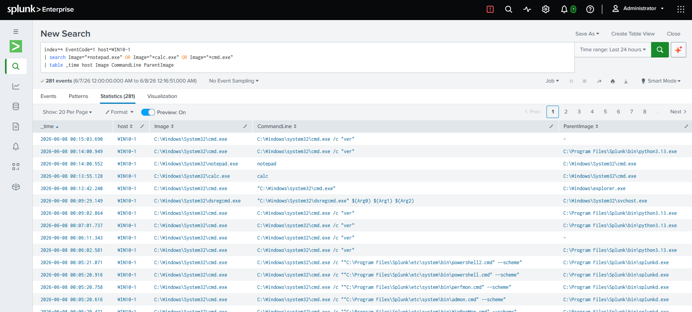
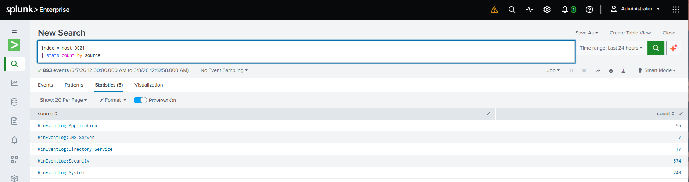
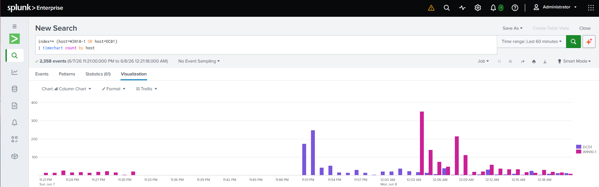
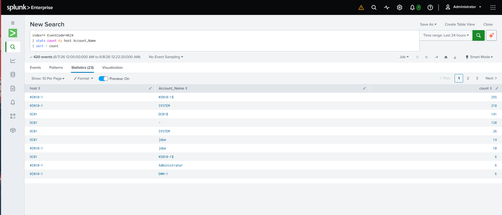
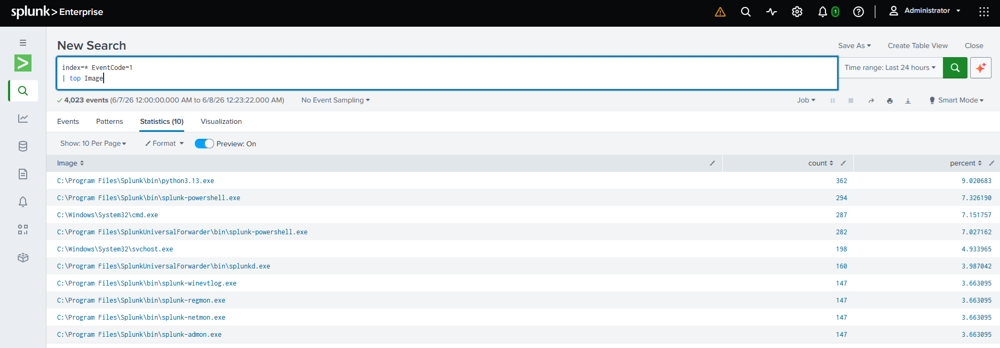

# Home SOC Lab

## Overview

This project documents the design, implementation, and ongoing development of a Home Security Operations Center (SOC) Lab built using Active Directory, Sysmon, Splunk Enterprise, and Kali Linux.

The goal of this environment is to gain hands-on experience with security monitoring, centralized log collection, endpoint telemetry, detection engineering, threat hunting, and attack simulation within a controlled enterprise-style network.

Rather than deploying standalone security tools, this lab was designed to simulate a small organizational environment where security events can be collected, analyzed, and investigated from a centralized Security Information and Event Management (SIEM) platform.

---

## Architecture Diagram



---

## Environment Overview

### DC01 - Domain Controller

**Operating System:** Windows Server 2022

#### Services

- Active Directory Domain Services
- DNS Server
- Sysmon
- Splunk Universal Forwarder

#### Purpose

- Centralized authentication
- DNS resolution
- Security event generation
- Domain management

---

### WIN10-1 - Endpoint

**Operating System:** Windows 10 Enterprise

#### Services

- Domain Joined Workstation
- Sysmon
- Splunk Universal Forwarder

#### Purpose

- Simulated enterprise workstation
- Endpoint telemetry collection
- User activity generation
- Security event generation

---

### Ubuntu Server

**Operating System:** Ubuntu Server

#### Services

- Splunk Enterprise
- Splunk Web Interface (Port 8000)
- Splunk Receiving Port (Port 9997)

#### Purpose

- Centralized log aggregation
- Security monitoring
- Detection engineering
- Threat hunting

---

### Kali Linux

**Operating System:** Kali Linux

#### Capabilities

- Network Scanning
- Enumeration
- Attack Simulation
- Detection Validation

#### Purpose

- Generate realistic attack traffic
- Validate detections
- Simulate adversary behavior

---

## Network Architecture

| System | IP Address | Role |
|----------|----------|----------|
| DC01 | 10.10.10.10 | Domain Controller / DNS |
| WIN10-1 | 10.10.10.20 | Domain Joined Endpoint |
| Ubuntu Server | 10.10.10.30 | Splunk Enterprise SIEM |
| Kali Linux | 10.10.10.40 | Attack Simulation |

**Lab Network**

```text
10.10.10.0/24
```

---

## Telemetry Sources

The following telemetry is currently being collected and analyzed within Splunk Enterprise:

### Windows Security Logs

- Successful Logons
- Failed Logons
- Account Activity
- Audit Events

### Windows System Logs

- Service Activity
- System Events
- Driver Events

### Windows Application Logs

- Application Activity
- Application Errors

### Active Directory Logs

- Directory Service Events
- Domain Controller Activity

### DNS Logs

- DNS Server Events
- Query Activity

### Sysmon Logs

- Process Creation
- Parent/Child Process Relationships
- Command Line Logging
- File Hashes
- Network Connections

---

## Centralized Log Collection

DC01 and WIN10-1 forward telemetry to Splunk Enterprise using Splunk Universal Forwarders.

This allows security events from multiple systems to be centralized, searched, correlated, and investigated through a single SIEM platform.



---

## Sysmon Process Monitoring

Sysmon Event ID 1 provides detailed visibility into process creation activity.

This enables:

- Process monitoring
- Parent-child relationship analysis
- Command-line visibility
- Detection of suspicious execution patterns

Example process creation events collected from WIN10-1:



---

## Domain Controller Telemetry

The domain controller forwards multiple Windows Event Log sources into Splunk Enterprise.

Collected telemetry includes:

- Security Logs
- System Logs
- Application Logs
- Directory Service Logs
- DNS Server Logs



---

## Event Volume Monitoring

Splunk visualizations provide visibility into activity across hosts over time.

This allows analysts to:

- Monitor event volume
- Identify spikes in activity
- Compare host behavior
- Support investigations



---

## Authentication Monitoring

Authentication events provide visibility into successful and failed logon activity.

### Key Event IDs

| Event ID | Description |
|-----------|-----------|
| 4624 | Successful Logon |
| 4625 | Failed Logon |

These events can be used to identify:

- Brute-force attempts
- Unauthorized access attempts
- Account misuse
- User activity



---

## Process Analysis

Sysmon telemetry can be leveraged to identify unusual process execution and investigate potentially malicious activity.

Example process analysis:



---

## Technologies Used

### Infrastructure

- VirtualBox
- Windows Server 2022
- Windows 10 Enterprise
- Ubuntu Server
- Kali Linux

### Security Tools

- Splunk Enterprise
- Splunk Universal Forwarder
- Sysmon

### Services

- Active Directory
- DNS

---

## Key Skills Demonstrated

### Security Monitoring

- Log Analysis
- Event Correlation
- Security Investigation

### Detection Engineering

- Sysmon Event Analysis
- Windows Event Log Analysis
- Process Monitoring

### Infrastructure Administration

- Active Directory Administration
- DNS Administration
- Windows Administration
- Linux Administration

### SIEM Operations

- Splunk Configuration
- Log Ingestion
- Search Development
- Visualization

---

## Lessons Learned

Throughout this project, I gained hands-on experience with:

- Active Directory deployment and administration
- DNS configuration and troubleshooting
- Domain joining Windows endpoints
- Splunk Enterprise deployment
- Splunk Universal Forwarder configuration
- Sysmon deployment and configuration
- Windows Event Log collection
- Centralized log management
- Security monitoring workflows
- Troubleshooting log ingestion issues

One of the most valuable aspects of this project was troubleshooting Sysmon integration and log forwarding issues while building a centralized monitoring environment. Resolving these challenges provided practical experience that closely resembles real-world security operations work.

---

## Future Enhancements

Planned additions include:

- Custom Splunk Dashboards
- Detection Rules
- Scheduled Alerts
- Threat Hunting Playbooks
- PowerShell Monitoring
- Brute Force Detection
- Nmap Detection
- MITRE ATT&CK Mapping
- Additional Windows Endpoints
- Vulnerability Scanning

---

## Project Status

**Status:** Active Development

### Completed

- Active Directory Deployment
- DNS Deployment
- Domain Joined Endpoint
- Sysmon Deployment
- Splunk Enterprise Deployment
- Splunk Universal Forwarder Configuration
- Centralized Log Collection

### In Progress

- Detection Engineering
- Dashboard Development
- Threat Hunting Scenarios
- Attack Simulations
